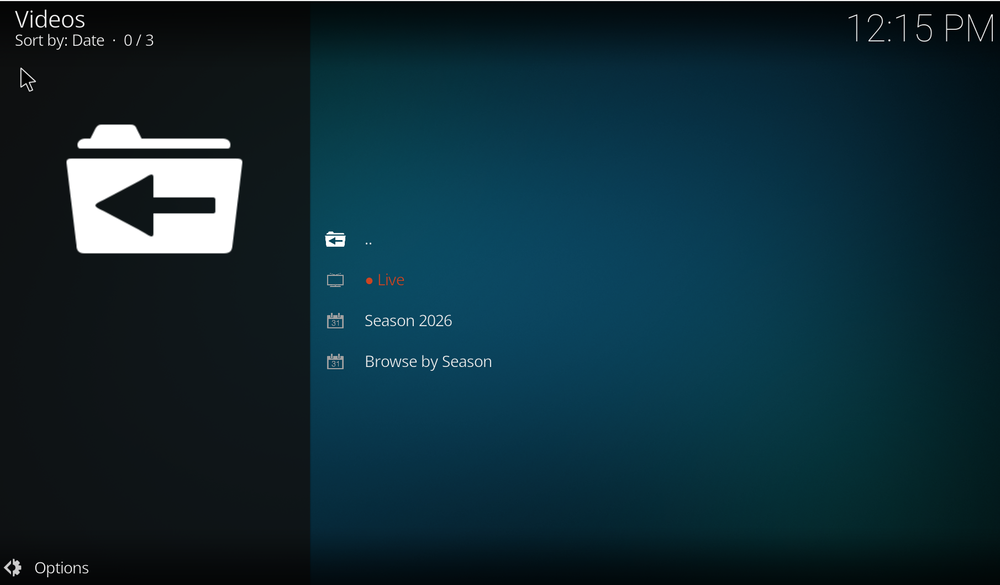
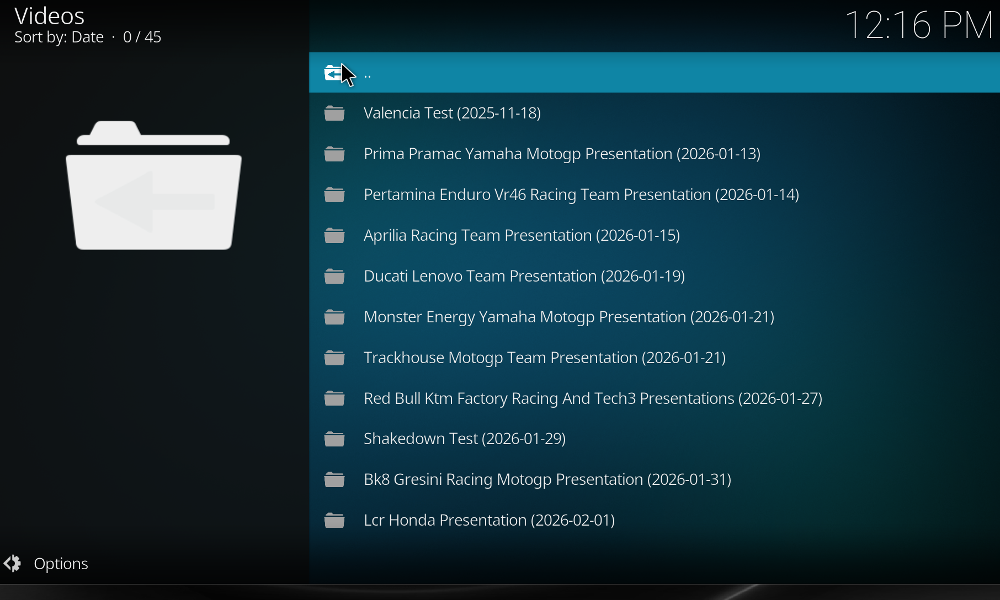
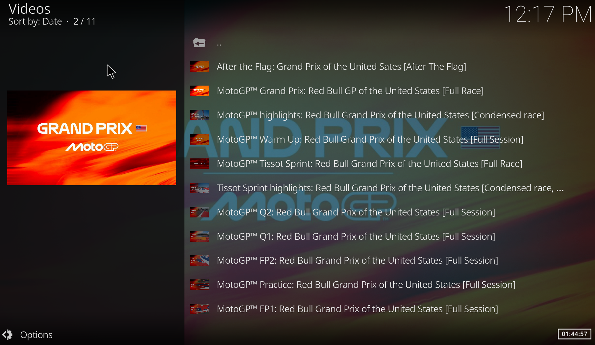
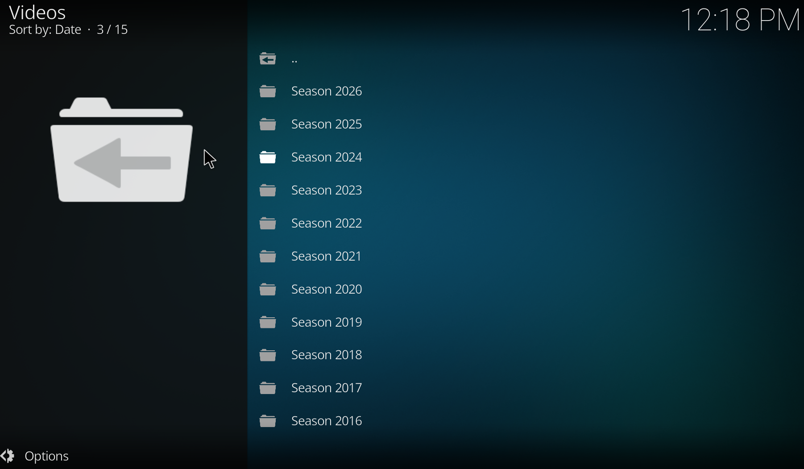
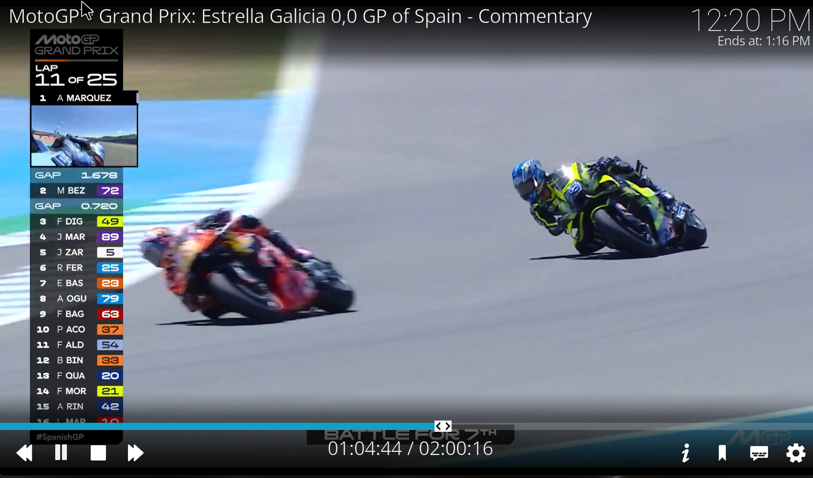
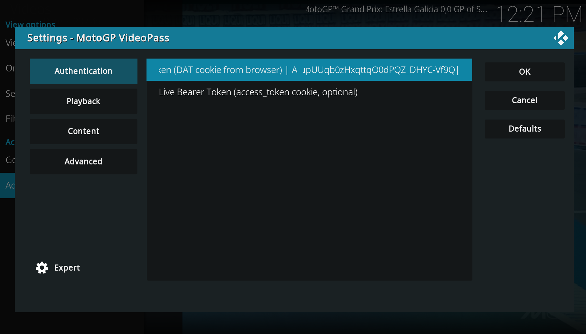

# MotoGP VideoPass for Kodi

**Unofficial MotoGP VideoPass add-on for Kodi.**

MotoGP VideoPass for Kodi is an unofficial Kodi add-on that lets MotoGP VideoPass subscribers browse and watch MotoGP content directly inside Kodi. It is also known as a MotoGP Kodi add-on, MotoGP VideoPass Kodi plugin, or `plugin.video.motogp`.

---

## Screenshots

| | | |
|---|---|---|
|  |  |  |
| Home screen | Seasons | Events |
|  |  |  |
| Sessions / feeds | Playback | Settings & login |

---

## Features

- Browse MotoGP VideoPass content from inside Kodi
- Watch races, sprint races, qualifying, and practice sessions
- Browse seasons (back to 2012) and events
- Multiple camera feeds per session: Commentary, Ambient, Helicopter, Onboard 1–4
- **Live race streaming** when an event is live on motogp.com (since v0.2.0)
- Login with your existing MotoGP VideoPass account (DAT cookie)
- Adaptive streaming via `inputstream.adaptive` — DASH for VOD, HLS for live
- Up to 1080p / 50 fps where the source provides it
- Works on TV-friendly Kodi interface (Estuary and other skins)

## Installation

### Recommended — via the YPoulis Kodi Repository (auto-updates)

Install the repository once and Kodi will keep this add-on (and the YouTube Music add-on) up to date automatically.

1. Download **`repository.ypoulis-1.0.0.zip`** from [the repository's releases](https://github.com/ypoulis-hub/kodi-repo/releases/latest) (or [direct link](https://ypoulis-hub.github.io/kodi-repo/zips/repository.ypoulis/repository.ypoulis-1.0.0.zip)).
2. In Kodi → **Settings → Add-ons → Install from zip file** → select the downloaded ZIP.
3. Then **Install from repository → YPoulis Kodi Repository → Video add-ons → MotoGP VideoPass**.
4. Configure your MotoGP VideoPass authentication (see below).

Full instructions and one-click landing page: [ypoulis-hub.github.io/kodi-repo](https://ypoulis-hub.github.io/kodi-repo/).

### Alternative — install the ZIP manually

1. Download the latest **`plugin.video.motogp-x.y.z.zip`** from the [Releases page](https://github.com/ypoulis-hub/kodi-motogp-videopass/releases/latest).
2. In Kodi → **Settings → Add-ons → Install from zip file** → select the downloaded ZIP.
3. Open the add-on once it appears under **Video add-ons**.
4. Configure your MotoGP VideoPass authentication (see below).

> Manual installs do not auto-update — you'll need to repeat the steps above each release. Use the repository path if you want hands-off updates.

## Requirements

- Kodi 21 (Omega) or later
- An active **MotoGP VideoPass** subscription
- `inputstream.adaptive` add-on (bundled with most Kodi builds)

## Authentication / Login

Since v0.3.0 the add-on logs in directly with your **MotoGP account email and password** — no browser or cookie copying required, so it works fully headless on LibreELEC.

1. Open **Add-on Settings → Authentication**.
2. Enter your MotoGP **Email** and **Password** (the same ones you use on motogp.com).
3. Start browsing — the add-on signs in automatically, stores the token, and refreshes it on its own when it expires.

Your password is stored only in Kodi's local add-on settings on your device and is sent only to MotoGP's own login endpoint.

> **Fallback:** you can still paste a `DAT` token manually into the **Auth Token** field (from a browser's cookies) if you prefer not to store your password.

## Supported Kodi versions

- **Kodi 21 Omega** — primary target, regularly tested
- Kodi 20 Nexus may work but is not officially supported

## Supported platforms

- Windows 10 / 11
- LibreELEC (tested on x86_64 Generic builds)
- Other Linux desktops running Kodi
- macOS (untested but should work)

## Known limitations

- Some pre-2012 archive content is not yet available via the same browse path
- Live race streaming requires an active MotoGP VideoPass subscription that grants live access (most do)
- Resume playback across sessions is not yet implemented (see [ROADMAP](ROADMAP.md))

## FAQ

**Is this an official MotoGP VideoPass add-on?**
No. This is an unofficial Kodi add-on. It is not affiliated with MotoGP, Dorna Sports or VideoPass.

**Do I need a MotoGP VideoPass subscription?**
Yes — playback (both live and on-demand) requires an active VideoPass subscription tied to the cookie you provide.

**Does it stream live races?**
Yes. Since v0.2.0 the add-on shows a **● Live** entry at the top of the main menu when a session is live on motogp.com.

**Does it support replays?**
Yes — browse by season → event → category to find races, qualifying, practice and sprint sessions.

**Does it work on Kodi 21 Omega?**
Yes — Kodi 21 Omega is the primary target.

**Does it work on LibreELEC?**
Yes — it is regularly tested on LibreELEC running Kodi 21.

## Troubleshooting

| Problem | Likely cause / fix |
|---|---|
| Login failed / authentication failed | Token missing, copied incompletely, or expired. Re-copy the `DAT` cookie from a fresh login. |
| Video does not start | Check `kodi.log` for `inputstream.adaptive` errors. Ensure the inputstream.adaptive add-on is installed and enabled. |
| Subscription not detected | The token may not grant the requested content (live vs. archive). Confirm playback works on motogp.com first. |
| Stream unavailable | Pulselive may be temporarily down or the event has been pulled. Retry after a few minutes. |
| Event list not loading | Network or Pulselive API hiccup. Refresh the directory or check the Kodi log for HTTP errors. |
| Playback buffering | Reduce **Max Video Quality** in the add-on settings, or test your network speed against motogp.com. |

## Changelog

See [CHANGELOG.md](CHANGELOG.md).

## Roadmap

See [ROADMAP.md](ROADMAP.md).

## Support

- Open a [GitHub issue](https://github.com/ypoulis-hub/kodi-motogp-videopass/issues) using one of the templates (Bug, Feature request, Installation problem, Authentication problem).
- Use [GitHub Discussions](https://github.com/ypoulis-hub/kodi-motogp-videopass/discussions) for questions, feature ideas or general feedback.
- Follow the project on the [Kodi forum thread](https://forum.kodi.tv/showthread.php?tid=385237).

If you find this add-on useful, you can support development with a one-time donation:

## Disclaimer

This is an unofficial add-on and is **not** affiliated with, endorsed by or sponsored by MotoGP, Dorna Sports or VideoPass. A valid **MotoGP VideoPass** subscription is required for playback.

## License

[MIT](LICENSE)
